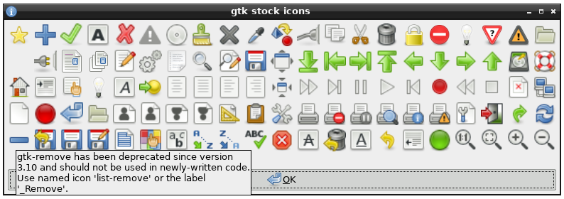

# gtk-stock-icons2

### show array of GTK stock icons

This `gtkdialog` application was inspired by brokenman's [similar script](https://forum.porteus.org/viewtopic.php?p=8614#p8614) for Porteous.

There are two main differences:

 * Hovering over an icon displays not just the icon name but also useful
   information about new naming conventions and deprecated usage
 * One more icon is documented (I forget which one).

The intended target audience for this tool is `gtkdialog` application developers.

The undelying `gtkdialog` structure is generated with `awk`.

[forum discussion](https://forum.puppylinux.com/viewtopic.php?p=81832#p81832)
